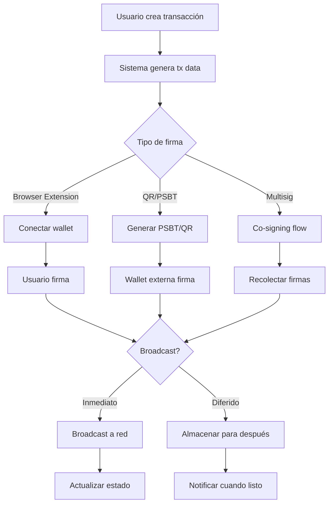

# Sistema de Transacciones Blockchain - Arquitectura

## Visión General

Este documento describe la arquitectura del sistema de transacciones blockchain para CryptoManager, diseñado para soportar múltiples blockchains, tipos de transacciones, y métodos de firma.

## Flujo de Trabajo



## Componentes Principales

### 1. Transaction Service (Backend)

Responsable de:
- Generar datos de transacciones sin firmar
- Calcular gas fees y nonces
- Validar transacciones
- Almacenar estado de transacciones
- Broadcast a redes blockchain

### 2. Wallet Adapters (Frontend)

Abstracciones para conectar con:
- MetaMask y wallets EVM (EIP-1193)
- Phantom y wallets Solana
- WalletConnect (universal)
- Sparrow/BlueWallet para Bitcoin

### 3. Blockchain Services

Implementaciones específicas por chain:

#### EVM Chains (Ethereum, Polygon, BSC, etc.)
- Librería: ethers.js v6
- Features: EIP-1559, legacy transactions, contract interactions
- Firmas: Personal sign, typed data (EIP-712)

#### Solana
- Librería: @solana/web3.js
- Features: Versioned transactions, priority fees
- Firmas: Transaction.sign()

#### Bitcoin
- Librería: bitcoinjs-lib
- Features: PSBT, taproot, segwit
- Output: PSBT files, QR codes (BIP-21/72)

## Estructura de Datos

### Tabla: blockchain_transactions

```sql
CREATE TABLE blockchain_transactions (
  id INTEGER PRIMARY KEY AUTOINCREMENT,
  empresa_id INTEGER NOT NULL,
  cuenta_id INTEGER NOT NULL,  -- wallet origen
  
  -- Identificación
  tx_hash TEXT,  -- null hasta broadcast
  status TEXT CHECK(status IN ('draft', 'pending_signature', 'signed', 'broadcasting', 'confirmed', 'failed', 'cancelled')),
  
  -- Blockchain info
  blockchain TEXT NOT NULL,  -- ETH, SOL, BTC, etc.
  network TEXT,  -- mainnet, testnet, etc.
  
  -- Tipo de transacción
  tx_type TEXT CHECK(tx_type IN ('transfer', 'batch_transfer', 'contract_call', 'defi_swap', 'defi_lend', 'multisig_create')),
  
  -- Datos de la transacción (JSON)
  tx_data TEXT NOT NULL,  -- serialized transaction data
  
  -- Nonce management
  nonce INTEGER,
  use_future_nonce BOOLEAN DEFAULT 0,
  broadcast_after DATETIME,  -- para transacciones diferidas
  
  -- Fees
  gas_price TEXT,
  gas_limit TEXT,
  max_fee_per_gas TEXT,  -- EIP-1559
  max_priority_fee_per_gas TEXT,  -- EIP-1559
  
  -- Cost tracking
  total_amount TEXT,  -- en wei/satoshis/lamports
  fee_estimate TEXT,
  
  -- Metadata
  description TEXT,
  reference_id TEXT,  -- link a factura, etc.
  
  -- Timestamps
  created_at DATETIME DEFAULT CURRENT_TIMESTAMP,
  signed_at DATETIME,
  broadcast_at DATETIME,
  confirmed_at DATETIME,
  
  -- Foreign keys
  FOREIGN KEY (empresa_id) REFERENCES empresas(id),
  FOREIGN KEY (cuenta_id) REFERENCES cuentas(id)
);
```

### Tabla: transaction_recipients

```sql
CREATE TABLE transaction_recipients (
  id INTEGER PRIMARY KEY AUTOINCREMENT,
  transaction_id INTEGER NOT NULL,
  
  -- Destinatario
  recipient_address TEXT NOT NULL,
  recipient_type TEXT CHECK(recipient_type IN ('wallet', 'contract', 'multisig')),
  
  -- Monto
  amount TEXT NOT NULL,  -- en wei/satoshis/lamports
  token_address TEXT,  -- null para native coin
  
  -- Metadata
  description TEXT,
  reference_type TEXT,  -- 'invoice', 'salary', 'expense', etc.
  reference_id INTEGER,
  
  -- Orden para batch transactions
  sort_order INTEGER DEFAULT 0,
  
  FOREIGN KEY (transaction_id) REFERENCES blockchain_transactions(id) ON DELETE CASCADE
);
```

### Tabla: transaction_signatures

```sql
CREATE TABLE transaction_signatures (
  id INTEGER PRIMARY KEY AUTOINCREMENT,
  transaction_id INTEGER NOT NULL,
  
  -- Quién firmó
  signer_address TEXT NOT NULL,
  signer_type TEXT CHECK(signer_type IN ('user', 'multisig_member', 'hardware_wallet')),
  
  -- La firma
  signature TEXT NOT NULL,
  signature_data TEXT,  -- JSON con datos adicionales
  
  -- Para multisig
  signature_index INTEGER,  -- índice en el multisig
  
  signed_at DATETIME DEFAULT CURRENT_TIMESTAMP,
  
  FOREIGN KEY (transaction_id) REFERENCES blockchain_transactions(id) ON DELETE CASCADE
);
```

## Tipos de Transacciones Soportadas

### 1. Transfer Simple
```typescript
interface SimpleTransfer {
  to: string;
  value: string;  -- en wei/satoshis
  data?: string;  -- para contract calls
}
```

### 2. Batch Transfer (Multi-recipient)
```typescript
interface BatchTransfer {
  recipients: Array<{
    to: string;
    value: string;
    tokenAddress?: string;
  }>;
  -- En EVM: usa multicall o múltiples transfers
  -- En Solana: single transaction con múltiples instructions
  -- En Bitcoin: múltiples outputs
}
```

### 3. DeFi Interactions
```typescript
interface DeFiInteraction {
  protocol: 'uniswap' | 'aave' | 'compound' | 'lido' | 'jupiter';
  action: 'swap' | 'supply' | 'borrow' | 'stake' | 'unstake';
  params: Record<string, any>;
}
```

### 4. Multisig Transactions
```typescript
interface MultisigTransaction {
  multisigAddress: string;
  threshold: number;
  signers: string[];
  signaturesCollected: number;
}
```

## Integración con Wallets

### EVM Wallets (MetaMask, etc.)

```typescript
// Flujo de firma
const tx = await provider.getTransaction(txData.hash);
const signedTx = await signer.signTransaction(tx);
// o para typed data
const signature = await signer.signTypedData(domain, types, value);
```

### Solana Wallets (Phantom, etc.)

```typescript
// Flujo de firma
const transaction = VersionedTransaction.deserialize(buffer);
const signed = await wallet.signTransaction(transaction);
```

### Bitcoin Wallets (Sparrow, etc.)

```typescript
// Generar PSBT
const psbt = new Psbt({ network });
psbt.addInput({...});
psbt.addOutput({...});
const psbtBase64 = psbt.toBase64();

// Exportar como QR o archivo
// Importar PSBT firmado
const signedPsbt = Psbt.fromBase64(signedPsbtBase64);
```

## Manejo de Nonces

### Nonce Normal
- Se obtiene del mempool: `provider.getTransactionCount(address, 'pending')`
- Se incrementa secuencialmente

### Nonce Futuro
- Permite firmar transacciones que se ejecutarán después
- Útil para: payroll programado, pagos condicionales
- Requiere: almacenamiento seguro de tx firmadas, mecanismo de broadcast

## Seguridad

1. **Nunca almacenar private keys**: Solo transacciones firmadas por el usuario
2. **Validación de datos**: Verificar addresses, montos, antes de generar tx
3. **Rate limiting**: Prevenir spam de transacciones
4. **Audit logging**: Registrar todas las operaciones críticas

## Próximos Pasos

1. Implementar servicios base (EVM, Solana, Bitcoin)
2. Crear UI de transaction builder
3. Integrar MetaMask y Phantom
4. Implementar PSBT para Bitcoin
5. Agregar soporte multisig
6. Implementar deferred broadcasting
